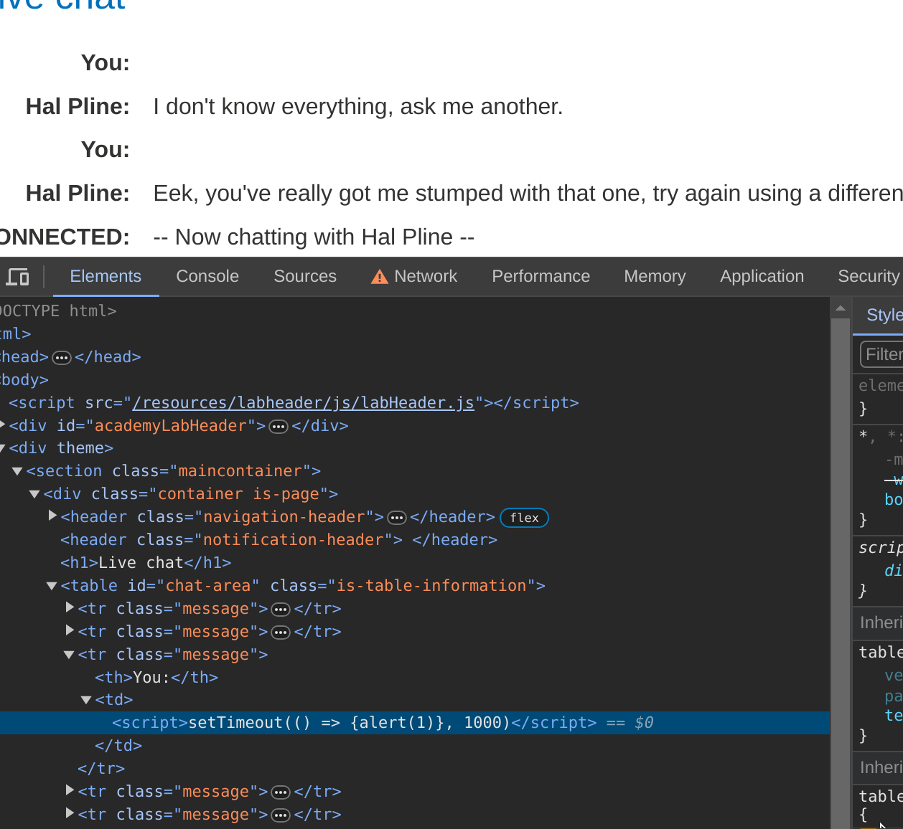

## Lab: Manipulating WebSocket messages to exploit vulnerabilities

Defence
- encode chat message to HTML code, to defence XSS attacks, but on client side

Bypass
- Intercept chat message from client, change the encoded message to a raw html node: ``

Question:
why `` does not work?

